# **SOC Shift 1 Ticket Investigations**

Engagement: Cloudora Analyst: SOC Trainee Queue: CLD-0201 to CLD-0204

## **CLD-0201 Investigation**

Ticket: CLD-0201 Alert: Repeated failed sign ins for
jt-admin@cloudora.io Initial Severity: Medium Final Severity:
Informational Verdict: False Positive

### **1. Alert**

Entra ID detected 9 failed sign in attempts on a newly created
privileged account. Time: 06:48 to 07:09 UTC Source: 203.0.113.11,
London office Device: Windows 11, Edge

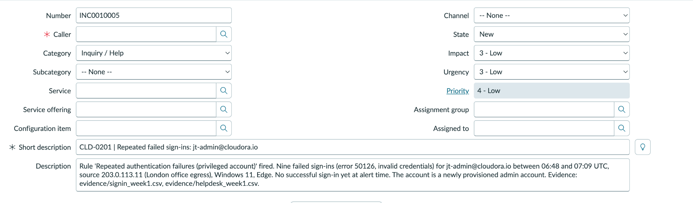

### **2. Hypotheses**

Hypothesis 1, Malicious: An attacker is trying to brute force a newly
created privileged account. Hypothesis 2, Benign: New employee James
Turner is having trouble with his temporary password.

### **3. Evidence**

Shift Handover James Turner started Monday. jt-admin was provisioned
Friday with a temporary password.

Sign In Logs 9 failures from the same corporate IP and device.
Successful login at 07:22 UTC.

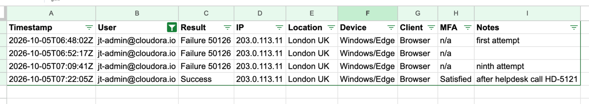

Helpdesk Ticket HD-5121 shows James called about Caps Lock on his
temporary password. The password was reset over a verified call.

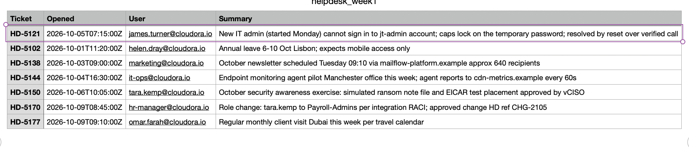

### **4. Reasoning**

This looked suspicious at first because it was a privileged account. The
evidence matched a normal onboarding issue: failed sign ins, then a
helpdesk call, then a password reset, then a successful login. All
activity stayed inside the corporate network on a known device.

### **5. Verdict**

False Positive. No sign of compromise. Severity: Medium to
Informational. Explained, authorized, resolved. Action: Closed and
referenced HD-5121. Noted that temporary passwords plus Caps Lock cause
admin account noise on day one.

### **6. Key Takeaways**

Write hypotheses before looking at evidence. Check other data sources
before deciding. Build a timeline before making a verdict. Do not rely
only on the automatic severity rating. Privileged account alerts need
careful checking. A false positive can still point out a process to
improve.

### **Evidence Used**

ServiceNow CLD-0201 Sign in logs, signin_week1.csv Helpdesk log,
helpdesk_week1.csv Shift handover notes

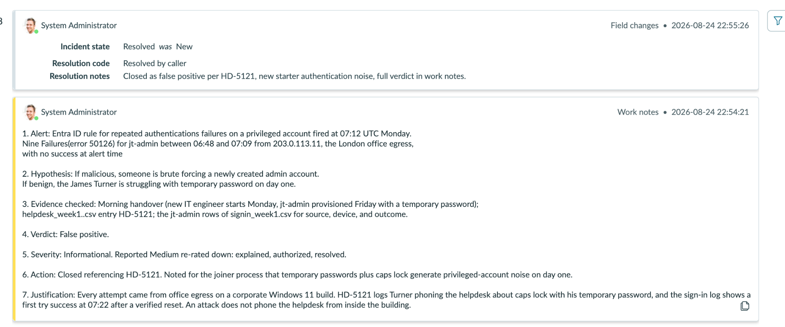

## **CLD-0202 Investigation**

Ticket: CLD-0202 Alert: PUA detected and removed on MAN-WS-204 Initial
Severity: Low Final Severity: Informational Verdict: False Positive

### **1. Alert**

The rule "Potentially unwanted application remediated" fired. A free PDF
converter was downloaded on MAN-WS-204, assigned user helen.dray, and it
carried PUA:Win32/BundleLoader. It was quarantined at 05:31 UTC and a
rescan at 07:31 UTC came back clean.

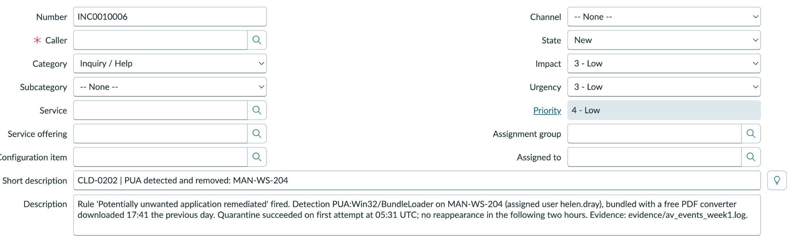

### **2. Hypotheses**

Hypothesis 1, Malicious: Unwanted software is still active on the
machine, or it dropped another payload. Hypothesis 2, Benign: A bundled
installer came with the free PDF converter, and the antivirus removed
it.

### **3. Evidence**

AV Event Log av_events_week1.log shows the full timeline on MAN-WS-204:
17:41 the previous day, freepdf_setup.exe downloaded. 05:31:02 UTC,
PUA:Win32/BundleLoader detected. 05:31:04 UTC, quarantine succeeded on
the first try. 07:31:04 UTC, rescan came back clean with no
reappearance.

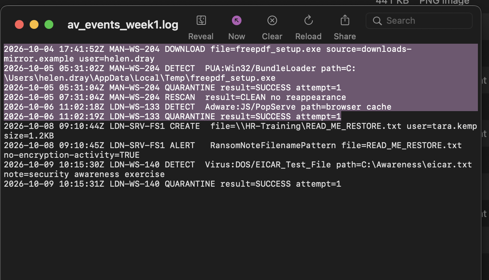

Helpdesk No tickets from helen.dray or IT about this machine during this
time.

### **4. Reasoning**

The rule name matters here. It fires on remediation, not detection,
which means the control already handled it before anyone reviewed the
alert. Quarantine worked on the first attempt, and the rescan two hours
later confirmed nothing came back.

### **5. Verdict**

False Positive. Benign and already handled. Severity: Low to
Informational. Quarantine succeeded with a clean rescan, so this is
closed. Action: Closed, referencing av_events_week1.log and Playbook
rule 01. Noted for awareness that free converter sites keep causing
bundled PUA.

### **6. Key Takeaways**

Alert names carry useful facts. Remediated is different from detected. A
rule working exactly as designed is still a useful finding. Check
remediation status before judging impact. There is no caller here since
the antivirus caught this on its own, not a person reporting it.

### **Evidence Used**

ServiceNow CLD-0202 Endpoint AV log, av_events_week1.log Shift handover
notes, intel digest on bundled PUA campaigns

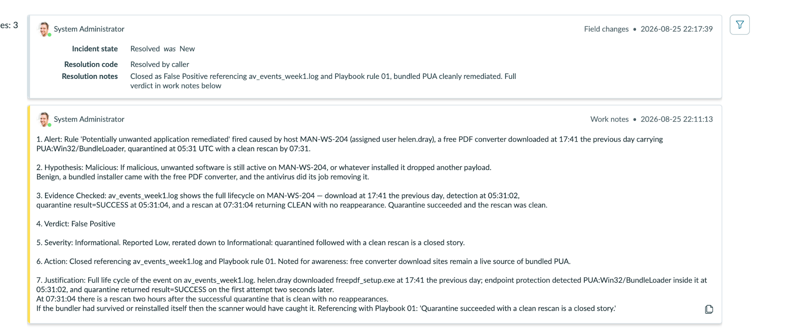

## **CLD-0203 Investigation**

Ticket: CLD-0203 Alert: First time sign in properties for
ewalsh.ext@cloudora.io Initial Severity: Low Final Severity: High, S3
Verdict: Escalate

### **1. Alert**

The rule "First time sign in properties, guest account" fired. Guest
account ewalsh.ext@cloudora.io, Eleanor Walsh from Bexley Payroll
Integrations, signed in successfully at 21:47 UTC from 198.51.100.77,
macOS, Safari. This is the account's first sign in outside 09:00 to
18:00.

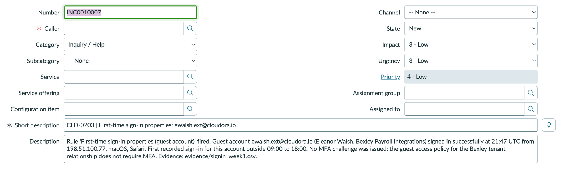

### **2. Hypotheses**

Hypothesis 1, Malicious: The account or session has been compromised,
and nothing currently in place would catch it. Hypothesis 2, Benign:
Eleanor Walsh is working later than usual, on her normal device and
network.

### **3. Evidence**

Sign In Baseline signin_week1.csv filtered on ewalsh.ext@cloudora.io,
comparing tonight to three earlier sign ins on Sep 28, Sep 30, and Oct
2.

IP address: 198.51.100.77 every time. Match. Device and client: macOS
and Safari every time. Match. MFA: none, guest policy does not require
it. Match. Hour: earlier sign ins ranged from 18:52 to 20:03. Tonight
was 21:47, the first time outside normal hours. Different.

Only 1 of 4 things changed. Looking at all four sign ins together, the
time got later each visit, 18:52, then 19:14, then 20:03, then 21:47.
This looks like a shifting schedule, not a sudden jump.

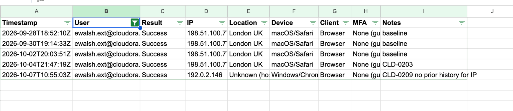

Handover Context The guest access policy does not require MFA. A policy
review is planned later this month.

### **4. Reasoning**

There are two separate questions here. The event and the exposure.

The event. Three of four things matched, and the one that changed fits a
pattern that was already building over time. This supports a benign read
of tonight.

The exposure. This account has no MFA. If it were compromised, a sign in
would look exactly like tonight's, since the IP and device do not prove
identity and there is no MFA to fail. The account has access to live
Bexley payroll data during active reporting on payroll themed phishing.
Impact is High. Confidence is Possible, since nothing confirms or rules
out compromise. High impact and Possible confidence gives S3 on the
severity matrix.

### **5. Verdict**

Escalate. Tonight's sign in looks benign, but the exposure cannot be
ruled out with the data available, which is a reason to escalate on its
own. Severity: High, S3. Reported Low, raised because of the account's
access and the lack of MFA. Action: Escalated to the vCISO per the
Escalation SOP. Noted that no MFA on guest accounts leaves a gap, since
password only access means a compromised sign in looks the same as a
normal one. Recommend prioritizing the planned guest MFA policy review.

### **6. Key Takeaways**

A benign event and a real exposure can both be true at the same time. A
matching baseline only means as much as the controls behind it. With no
MFA, a match does not rule out compromise. Escalate is different from
insufficient data. Escalate when you understand the situation but cannot
fix the gap yourself. A pattern across several sign ins tells you more
than one data point does.

### **Evidence Used**

ServiceNow CLD-0203 Sign in logs, signin_week1.csv Shift handover notes,
guest MFA policy Related account activity on CLD-0209, Oct 7, new IP and
device, flagged for next shift

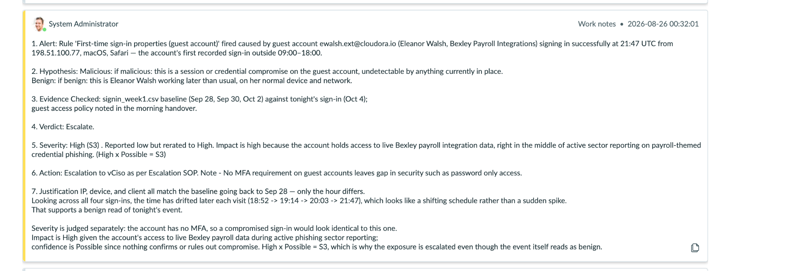

## **CLD-0204 Investigation**

Ticket: CLD-0204 Alert: Internal port sweep outside scan window from
203.0.113.44 Initial Severity: Medium Final Severity: Informational
Verdict: False Positive

### **1. Alert**

The rule "TCP port sweep" fired. Host 203.0.113.44, LDN-SCAN-01, the
weekly vulnerability scanner, probed over 3,800 ports across 160
internal hosts between 23:30 UTC Sunday night and 01:15 UTC Monday.

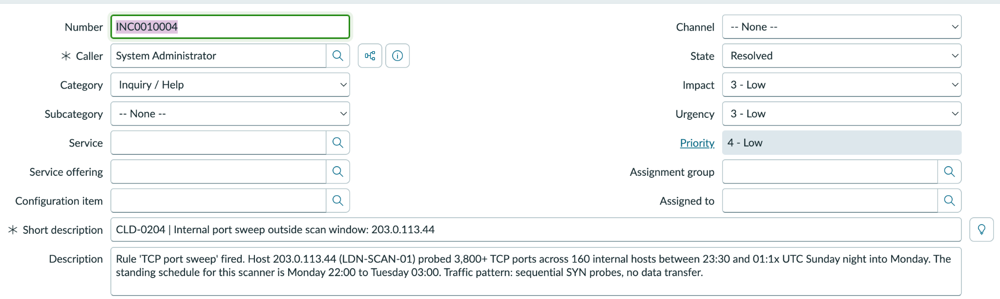

### **2. Hypotheses**

Hypothesis 1, Malicious: An attacker used the new scanner schedule as
cover to run reconnaissance. Hypothesis 2, Benign: This is the normal
scan, and the rule fired only because the schedule moved earlier this
week.

### **3. Evidence**

Shift Handover Change CHG-2101 moved the weekly scan from LDN-SCAN-01 to
Sunday 23:00 through Monday 03:00 UTC this week only, to make room for
storage migration work. Announced by IT ops on Friday.

Alert Details The alert window, 23:30 to 01:15 UTC, falls entirely
inside the CHG-2101 window. Traffic pattern was sequential SYN probes
with no data transfer, which is normal scanner behavior.

### **4. Reasoning**

The alert time is fully covered by the approved change window. The
traffic itself looks like a routine scan, not an attack. The alert only
fired because the rule was not updated for this week's one time schedule
change.

### **5. Verdict**

False Positive. Authorized activity. Severity: Medium to Informational.
Authorized under CHG-2101. Action: Closed, referencing CHG-2101. Noted
that future schedule changes should be reflected in the alert rule ahead
of time to avoid repeat noise.

### **6. Key Takeaways**

Check the change record before assuming something is unauthorized. Alert
rules can lag behind approved schedule changes. Traffic pattern is a
good second check alongside the change record. Judge activity by when it
happened, not by when the alert fired.

### **Evidence Used**

ServiceNow CLD-0204 Perimeter firewall and IDS alert Shift handover
notes, CHG-2101

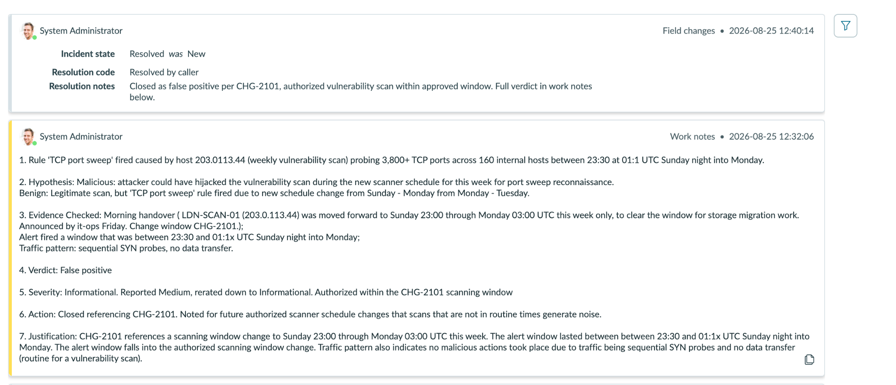a
