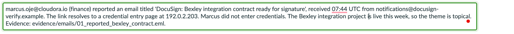
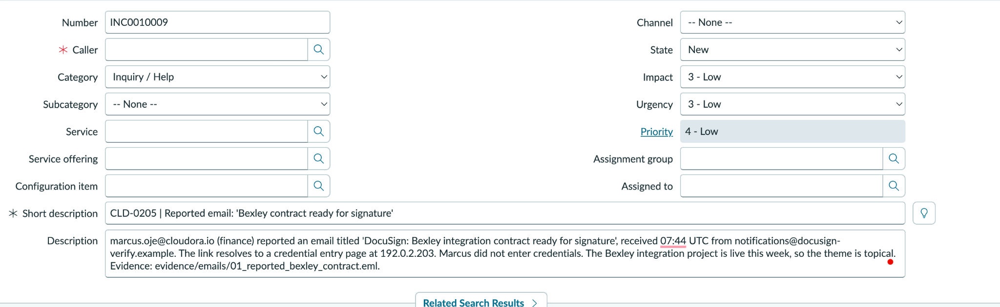
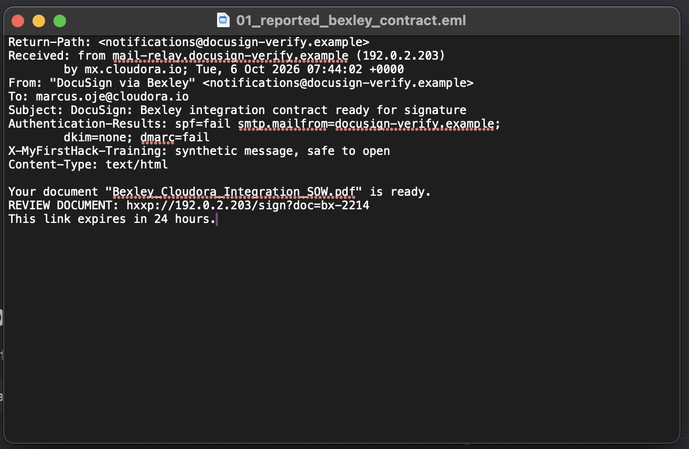
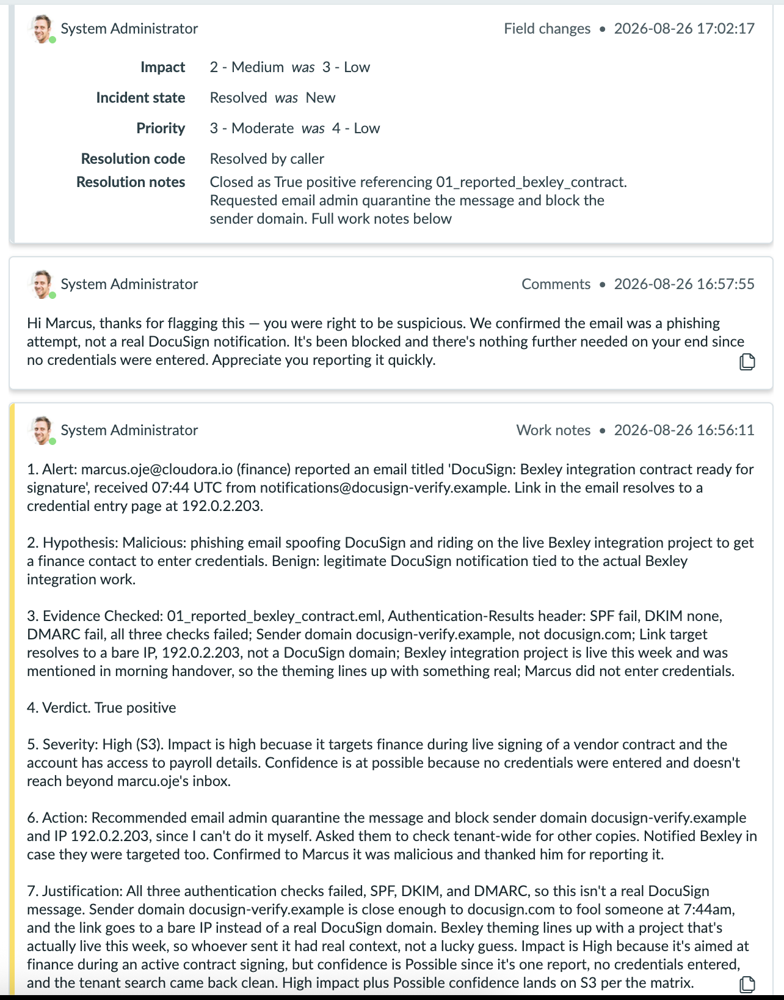
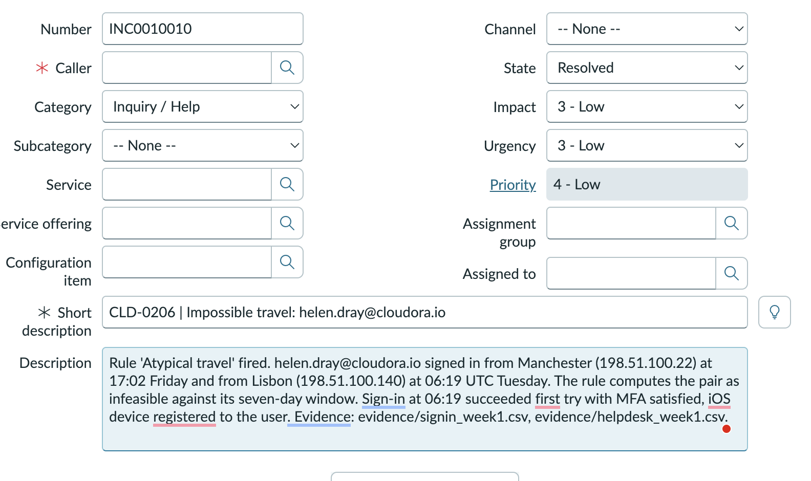
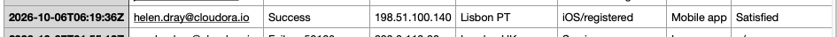
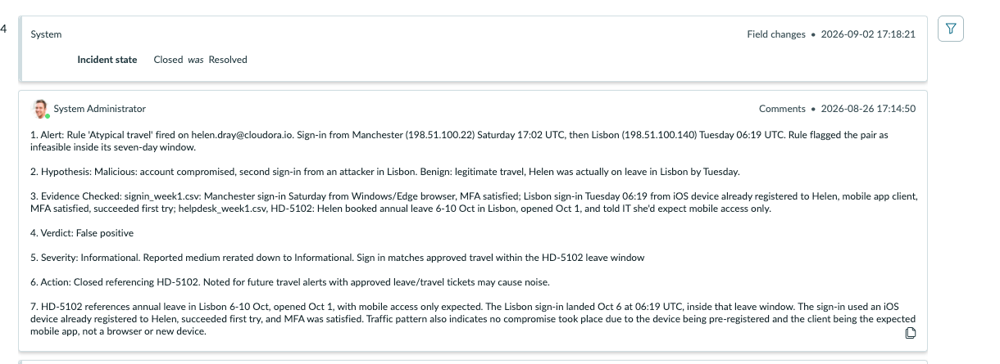
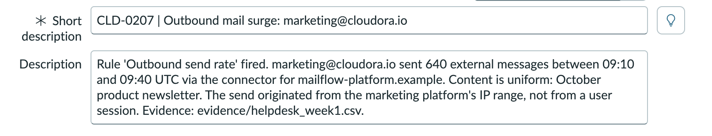
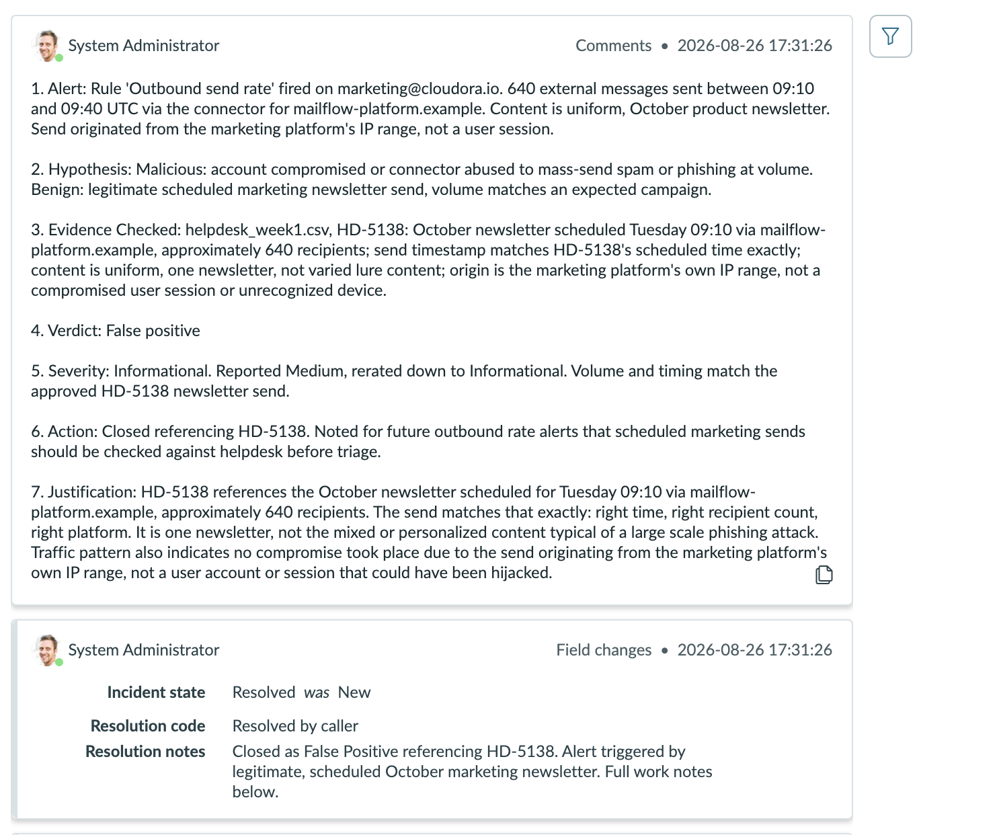
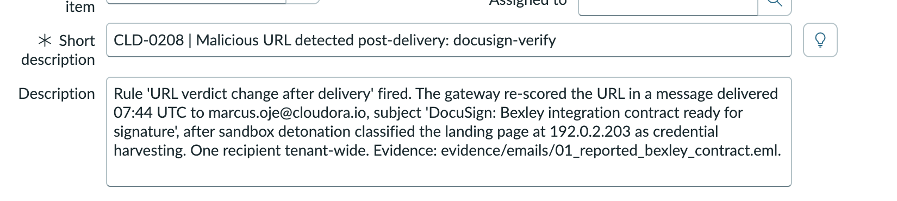

# **SOC Shift 2 Ticket Investigations**

Engagement: Cloudora Analyst: SOC Trainee Queue: CLD-0205 to CLD-0208

## **CLD-0205 Investigation**

Ticket: CLD-0205 Alert: Reported email, "Bexley contract ready for
signature" Initial Severity: Medium Final Severity: High, S3 Verdict:
True Positive

### **1. Alert**

marcus.oje@cloudora.io in Finance reported an email titled "DocuSign:
Bexley integration contract ready for signature", received at 07:44 UTC
from notifications@docusign-verify.example. The email link resolves to a
credential entry page at 192.0.2.203. Marcus did not enter credentials.
The Bexley integration project went live this week, making the theme
topical.

### **2. Hypotheses**

Hypothesis 1, Malicious: Phishing email spoofing DocuSign and riding on
the live Bexley integration project to get a finance contact to enter
credentials. Hypothesis 2, Benign: Legitimate DocuSign notification tied
to the actual Bexley integration work.

### **3. Evidence**

Email Headers, 01_reported_bexley_contract.eml Sender domain is
docusign-verify.example, not docusign.com. Authentication results show
spf=fail, dkim=none, and dmarc=fail, all three checks failed.

Link Target The link resolves to a bare IP address at
hxxp://192.0.2.203/sign?doc=bx-2214 instead of a DocuSign domain.

User and Context Handover confirmed Bexley integration is live this
week. Marcus did not enter credentials.

### **4. Reasoning**

All three authentication checks failed, SPF, DKIM, and DMARC, confirming
this is not genuine DocuSign infrastructure. The domain
docusign-verify.example is lookalike spoofing, and the URL points
directly to an unauthenticated bare IP address. Impact is High because
it targets finance during live contract signing. Confidence is Possible
because only one report occurred and no credentials were submitted. High
impact plus Possible confidence maps to S3 on the severity matrix.

### **5. Verdict**

True Positive. Severity: Medium rerated up to High, S3. Action:
Requested email admin quarantine the message tenant wide and block
sender domain docusign-verify.example and IP 192.0.2.203. Notified
Bexley in case of targeted partner spoofing. Sent confirmation to Marcus
thanking him for reporting.

### **6. Key Takeaways**

Phishing attacks timing their lures with live operational projects
require immediate scope verification across the tenant. Examining raw
headers via a text editor safely bypasses tracking pixels while exposing
failed SPF, DKIM, and DMARC alignment. Rapid user reporting contains
credential exposure before perimeter defenses flag the domain.

### **Evidence Used**

ServiceNow CLD-0205, INC0010009 Raw email header and body,
evidence/emails/01_reported_bexley_contract.eml Shift handover notes,
Bexley project schedule

## **CLD-0206 Investigation**

Ticket: CLD-0206 Alert: Impossible travel, helen.dray@cloudora.io
Initial Severity: Low / Medium Final Severity: Informational Verdict:
False Positive

### **1. Alert**

The rule "Atypical travel" fired for helen.dray@cloudora.io. Helen
authenticated from Manchester, 198.51.100.22, at 17:02 UTC and then from
Lisbon, 198.51.100.140, at 06:19 UTC Tuesday. The rule computed the
travel pair as infeasible within its seven day window.

### **2. Hypotheses**

Hypothesis 1, Malicious: Account compromised with unauthorized sign in
originating from an attacker in Lisbon. Hypothesis 2, Benign: Legitimate
travel where Helen was approved to be on leave in Lisbon by Tuesday.

### **3. Evidence**

Sign In Baseline, signin_week1.csv Manchester sign in Saturday used
Windows/Edge with MFA satisfied. Lisbon sign in Tuesday at 06:19 UTC was
performed from an iOS mobile device already registered to Helen, used
the mobile app client, satisfied MFA, and succeeded on the first
attempt.

Helpdesk Ticket, helpdesk_week1.csv Ticket HD-5102 shows Helen booked
annual leave for 6-10 Oct in Lisbon, opened on Oct 1, explicitly stating
she expected mobile access only.

### **4. Reasoning**

Ticket HD-5102 confirms pre-approved annual leave in Lisbon for 6-10
Oct. The Tuesday 06:19 UTC sign in on Oct 6 lands squarely inside that
approved window. The sign in utilized a pre-registered iOS client,
succeeded on the first try, satisfied MFA, and matched expected mobile
only usage.

### **5. Verdict**

False Positive. Severity: Medium rerated down to Informational. Action:
Closed referencing HD-5102. Noted that approved travel windows should be
cross checked early to prevent travel rule noise.

### **6. Key Takeaways**

Automated impossible travel rules flag geographic distance but lack
visibility into approved HR or helpdesk leave records. Verifying client
type, pre-existing device registration, and MFA completion confirms
legitimate user presence.

### **Evidence Used**

ServiceNow CLD-0206, INC0010010 Sign in logs, evidence/signin_week1.csv
Helpdesk log, evidence/helpdesk_week1.csv, Ticket HD-5102

## **CLD-0207 Investigation**

Ticket: CLD-0207 Alert: Outbound mail surge, marketing@cloudora.io
Initial Severity: Medium Final Severity: Informational Verdict: False
Positive

### **1. Alert**

The rule "Outbound send rate" fired after marketing@cloudora.io sent 640
external messages between 09:10 and 09:40 UTC through the connector for
mailflow-platform.example. Content was uniform, October product
newsletter, originating from the marketing platform IP range rather than
a user session.

### **2. Hypotheses**

Hypothesis 1, Malicious: Account compromised or outbound connector
abused to send mass spam or phishing lures. Hypothesis 2, Benign:
Legitimate scheduled marketing newsletter send matching expected
campaign volume.

### **3. Evidence**

Helpdesk Log, helpdesk_week1.csv Ticket HD-5138, logged 2026-10-03,
documents the October newsletter scheduled for Tuesday 09:10 UTC via
mailflow-platform.example with approximately 640 recipients.

Message Traffic and Origin Send time, recipient count, about 640, and
relay connector match HD-5138 exactly. Content was uniform rather than
varied phishing lures, and origin IPs mapped to the vendor platform
rather than an interactive user session.

### **4. Reasoning**

The send matches ticket HD-5138 across timing, recipient count, message
uniform body, and connector platform. Because traffic originated
directly from the marketing platform's server range without interactive
workstation compromise, the activity is legitimate and authorized.

### **5. Verdict**

False Positive. Severity: Medium rerated down to Informational. Action:
Closed referencing ticket HD-5138. Noted that scheduled outbound
marketing campaigns should be referenced against helpdesk tickets before
initiating triage.

### **6. Key Takeaways**

High volume outbound rate rules are prone to false alarms during planned
enterprise marketing distributions. Uniform lure structure and
authorized third party IP sources rule out hijacked user mailboxes.

### **Evidence Used**

ServiceNow CLD-0207 Helpdesk log, evidence/helpdesk_week1.csv, Ticket
HD-5138 Outbound connector mail flow records

## **CLD-0208 Investigation**

Ticket: CLD-0208 Alert: Malicious URL detected post-delivery,
docusign-verify Initial Severity: Medium Final Severity: Inherited High,
S3 Verdict: Duplicate of CLD-0205

### **1. Alert**

The rule "URL verdict change after delivery" fired after the mail
gateway re-scored the URL in a message delivered at 07:44 UTC to
marcus.oje@cloudora.io, "DocuSign: Bexley integration contract ready for
signature". Automated sandbox detonation classified landing page
192.0.2.203 as credential harvesting. Scope confirmed one recipient
tenant wide.

### **2. Hypotheses**

Hypothesis 1, Malicious: A separate or wider attack campaign beyond what
CLD-0205 covered. Hypothesis 2, Benign: The exact same email artifact as
CLD-0205 triggering an automated secondary detection path.

### **3. Evidence**

Alert Correlation Recipient, marcus.oje@cloudora.io, sender domain,
docusign-verify.example, landing page, 192.0.2.203, and timestamp, 07:44
UTC, match CLD-0205 identically.

Scope and Actions Tenant search verified exactly one delivery.
Containment actions, quarantine, domain and IP blocks, user follow up,
were already completed under CLD-0205.

### **4. Reasoning**

One single email generated two alerts via different detection paths,
first via user report, CLD-0205, and second via automated sandbox
detonation, CLD-0208. Because message metadata, target, and scope are
identical, and full remediation was executed under CLD-0205, this alert
represents a duplicate pipeline alert. The sandbox detonation finding
simply adds independent technical confirmation to CLD-0205.

### **5. Verdict**

Duplicate of CLD-0205. Severity: Inherits CLD-0205's S3 rating, High
impact, Possible confidence. Action: Closed as duplicate of CLD-0205,
the primary incident of record. Appended sandbox detonation confirmation
to CLD-0205 work notes.

### **6. Key Takeaways**

Automated security tooling frequently flags items already under manual
remediation via user report. Maintain a single primary ticket of record
to centralize evidence and prevent duplicated incident response
workflows.

### **Evidence Used**

ServiceNow CLD-0208 Prior incident record, CLD-0205 work notes and
evidence Gateway sandbox detonation output,
01_reported_bexley_contract.eml
